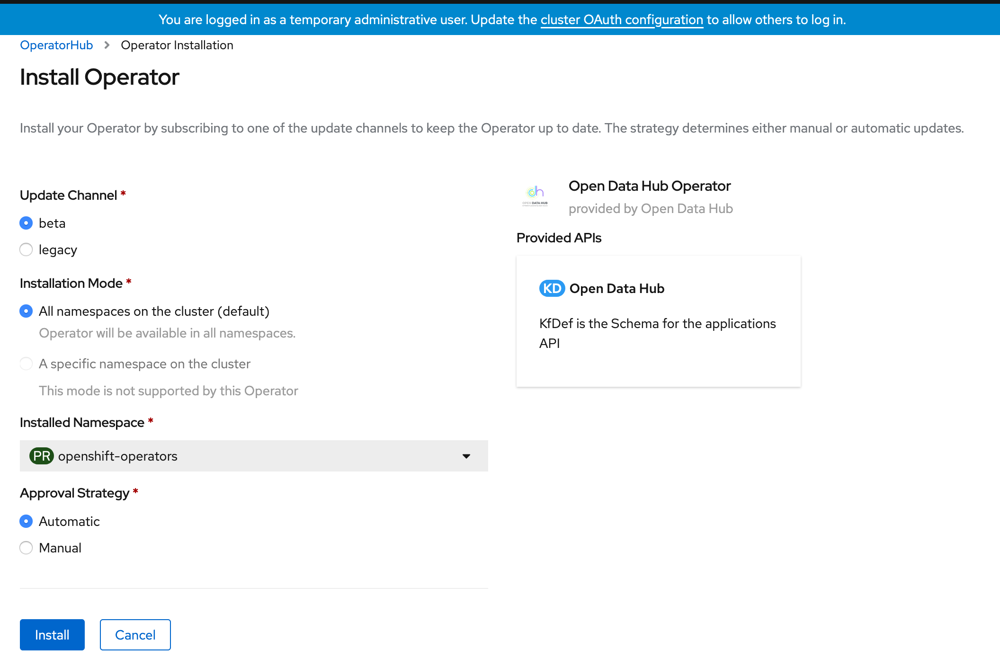
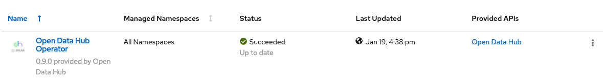
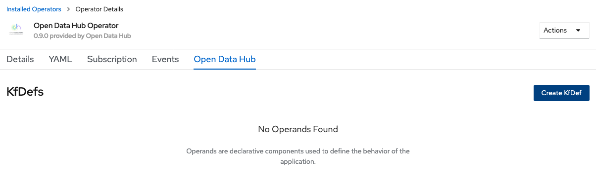
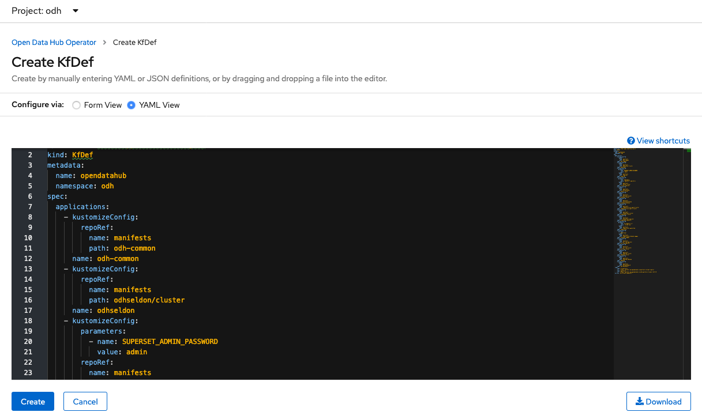
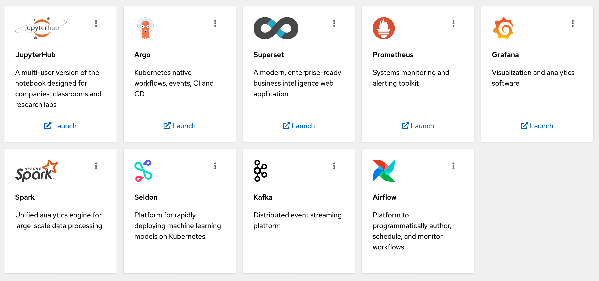
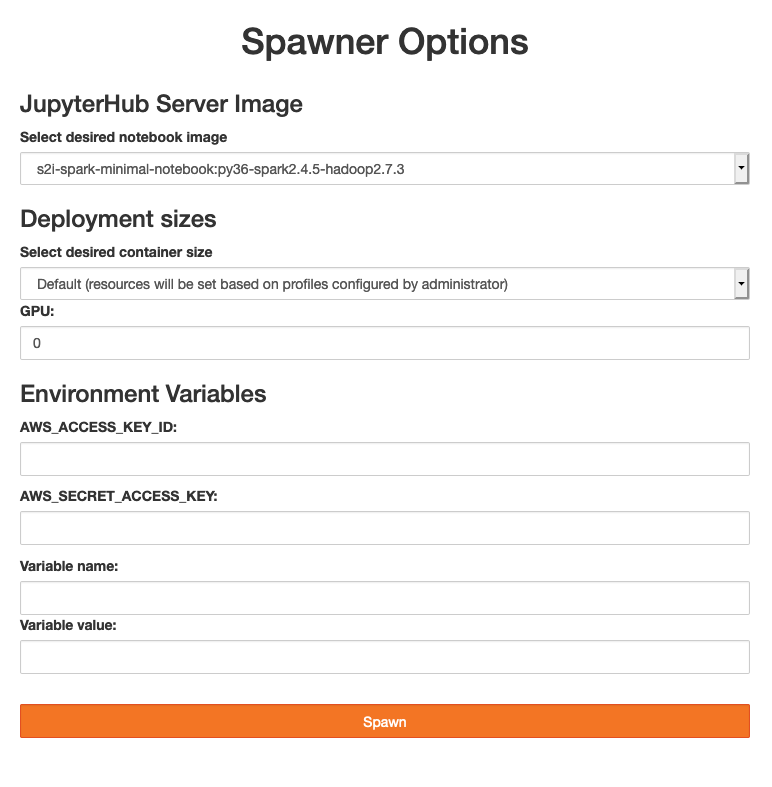
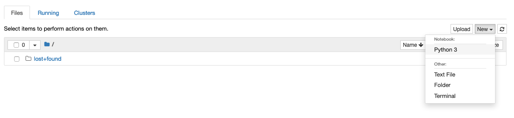

# Installing Open Data Hub on Azure Red Hat OpenShift

The purpose of this repo is to provide sample instructions for installing Open Data Hub (ODH) in Azure Red Hat OpenShift (ARO).  We'll do a smoke test of the components to ensure Open Data Hub components operate as expected.

## Prerequisites

* Azure Red Hat OpenShift 4
* Admin access to OpenShift

## Prep

Login to the cluster using `oc login` and admin credentials.

Create a new project for ODH:

```bash
oc new-project odh
```

## Open Data Hub

We will deploy ODH using the Operator.

Login to the cluster using the console and admin credentials.

Navigate to OperatorHub and search for `Open Data Hub Operator`.  Install using the `beta` channel.  The version installed in this guide is `0.9`.



Under the install operators, you should see the status of the operator change to `Succeeded`.  

You can also run:

```
oc wait --for=condition=Available deploy/opendatahub-operator -n openshift-operators
```

Make sure you are in the `odh` project.  Once the operator is running, click on `Open Data Hub` under the Provided APIs.



Select `Create KfDef`.



Switch to the YAML view if you would like to see the underlying components.  We'll stick with the defaults and install.  Click `Create`.



Wait until all the components are deployed and running:

```
oc get pods -n odh
```

> Output

```
NAME                                                          READY   STATUS      RESTARTS   AGE
airflow-on-k8s-operator-controller-manager-557945bd5c-mkqz8   1/1     Running     0          4h48m
argo-server-6dfb7f65f9-jbkbh                                  1/1     Running     0          4h48m
grafana-deployment-db6c8989c-hrsxz                            1/1     Running     0          4h47m
grafana-operator-69f449bf54-n7fq9                             1/1     Running     0          4h47m
jupyterhub-1-deploy                                           0/1     Completed   0          4h48m
jupyterhub-1-tcwvj                                            1/1     Running     0          4h47m
jupyterhub-db-1-deploy                                        0/1     Completed   0          4h48m
jupyterhub-db-1-wtmr9                                         1/1     Running     0          4h47m
jupyterhub-nb-kube-3aadmin                                    2/2     Running     0          4h28m
odh-dashboard-645579c66d-92jdg                                1/1     Running     0          4h47m
odh-dashboard-645579c66d-hd6tg                                1/1     Running     0          4h47m
odh-message-bus-entity-operator-6bfb9b9749-9mgxj              3/3     Running     0          5h20m
odh-message-bus-kafka-0                                       2/2     Running     0          5h21m
odh-message-bus-kafka-1                                       2/2     Running     0          5h21m
odh-message-bus-kafka-2                                       2/2     Running     0          5h21m
odh-message-bus-zookeeper-0                                   1/1     Running     0          5h22m
odh-message-bus-zookeeper-1                                   1/1     Running     0          5h22m
odh-message-bus-zookeeper-2                                   1/1     Running     0          5h22m
prometheus-operator-7dbf9b587c-t7kdl                          1/1     Running     0          4h47m
prometheus-prometheus-0                                       3/3     Running     1          4h47m
seldon-controller-manager-7d9b7d5b87-h62ds                    1/1     Running     0          4h48m
spark-operator-746dd44db5-pxk76                               1/1     Running     0          4h47m
superset-1-bg792                                              1/1     Running     0          5h22m
superset-1-deploy                                             0/1     Completed   0          5h22m
workflow-controller-fc6b4dcff-mjhhs                           1/1     Running     0          4h48m
```

You can also view the ODH components you installed in the ODH dashboard.  Grab the public route and open it in your browser.

```
echo $(oc get route odh-dashboard -n odh --template='http://{{.spec.host}}')
```

You should see:



## Smoke Test

Let's smoke test each component.

### JupyterHub

Launch JupyterHub from the ODH Dashboard.  Alternatively, you can grab the public route and open it in your browser.

```
echo $(oc get route jupyterhub -n odh --template='http://{{.spec.host}}')
```

Select the `s2i-spark-minimal-notebook` image and spawn the server.  Leave the other settings as they are.



Wait a few minutes for the server to start.

> Try refreshing the browser if you don't see any progress after a couple minutes.

Start a Python 3 notebook:



### Spark

In the JupyterHub notebook, let's run a simple Spark application. 

Copy this code and execute:

```python
from pyspark.sql import SparkSession, SQLContext
import os

# create a spark session
spark_cluster_url = f"spark://{os.environ['SPARK_CLUSTER']}:7077"
spark = SparkSession.builder.master(spark_cluster_url).getOrCreate()

# test
data = [1, 2, 3, 4, 5]
distData = spark.sparkContext.parallelize(data)
distData.reduce(lambda a, b: a + b)
```

> Output

```
15
```

### Seldon


### Argo


### Superset


### Prometheus


### Grafana


### Kafka


### Airflow


## Troubleshooting

1.  If you delete the ODH operator and need to reinstall again, you have to make sure the operator group has been deleted.  Otherwise the next install will move into a stuck `Pending` state.

```
oc delete operatorgroup opendatahub -n openshift-operators
```